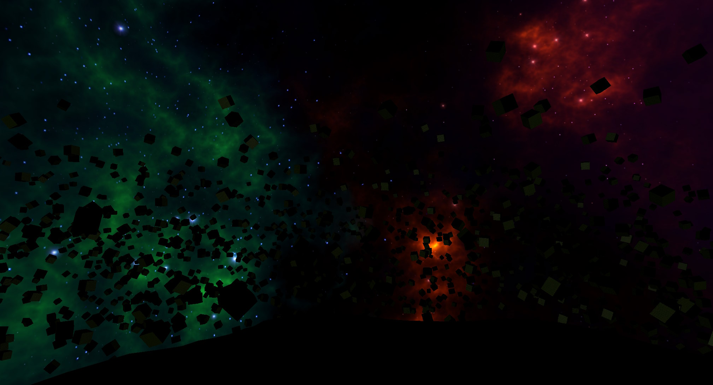
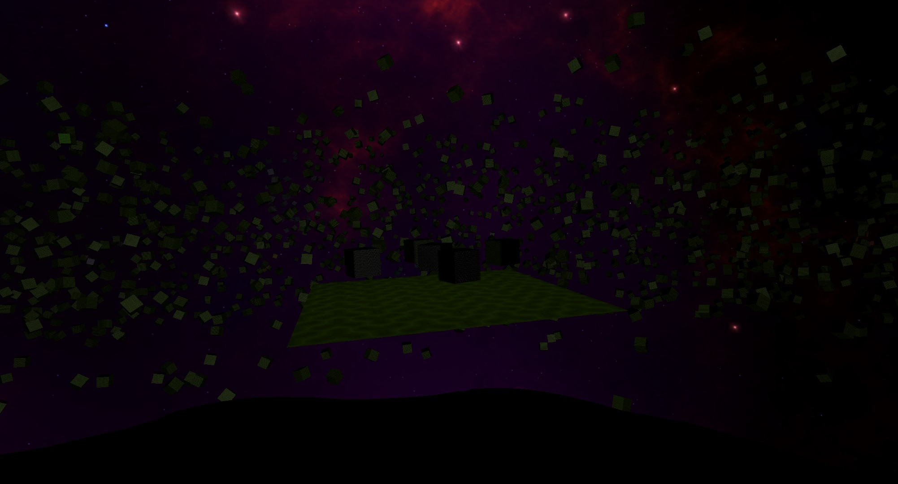

# EmptySpace - Yet Another Space Game




Space flight Demo with OpenGL based deferred rendering.

## Controls

```
 - W = accelerate forward
 - S = accelerate backward
 - A = accelerate to the left
 - D = accelerate to the right
 - Space = accelerate up
 - LCtrl = accelerate down
 - LShift = boost by factor 40
 - Q = roll left
 - E = roll right
 - R = stop acceleration
 - Mouse = define direction to accelerate
```

## Requirements

Development is done with
* Conan 2.x
* CMake 3.27.x
* Visual Studio 2022 Community Edition

External dependencies
* GLFW
* GLAD
* PhysX
* stb_image
* glm
* assimp

## Building

Note the conan install step can take a long time due to the size of PhysX

### Linux

Conan install for debug or release build type
```
conan install . --build=missing --settings=build_type=Debug
```

or release build type
```
conan install . --build=missing --settings=build_type=Release
```

CMake project generation for debug
```
cmake --preset conan-debug
```

or relase build
```
cmake --preset conan-release
```

Build files for debug build config should be located at
```
build/Debug
```

and for release config at
```
build/Release
```

Build the project in debug config with
```
cmake --build build/Debug
```

or in release config with
```
cmake --build build/Release
```

The resulting binaries can be found in their respective subdirectories in the build folder

### Windows

Conan install for debug and release build types for multi generator
```
conan install . --build=missing --settings=build_type=Debug && conan install . --build=missing --settings=build_type=Release
```

CMake project generation
```
cmake --preset conan-default
```

Open up the solution file in the build folder and build the project